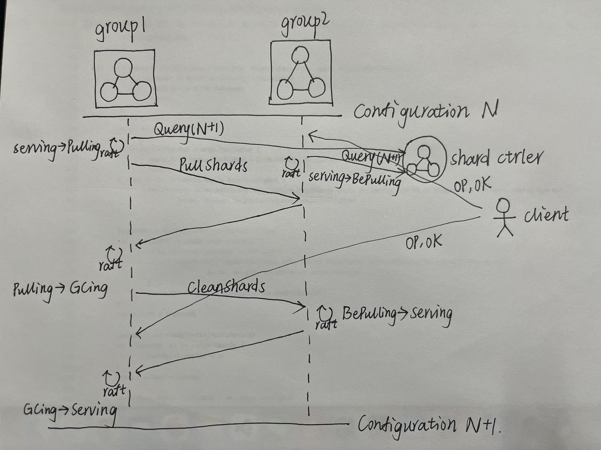

# MIT-6.824
Basic Sources for MIT 6.824 Distributed Systems Class

MIT 6.824 课程的学习资料 代码更新为2021版

## lab

### lab1
-	MapReduce Paper(OSDI'06)  
- [x]	Pass  
- coordinator只负责分配任务，全程不会接触数据，且仅当所有map任务完成后才会分发reduce任务；系统中会产生NMap*NReduce个中间数据集，本lab中因为所有worker部署在本地可以直接访问到，一般来说reduce任务worker需要通过RPC来访问到中间数据。  

### lab2  
-	Raft Paper(Extended 14)  
- [x]	2A pass  
	- test: sh ./test_election.sh  
- [x]	2B pass
	- test: sh ./test_replication.sh  
- [x]   2C pass  
	- test: sh ./test_persist.sh  
	- [ ] (TestFigure8Unreliable2C often fails) 
- [x]   2D pass
	- test: sh ./test_snapshot.sh  
- 注意点
	- log采用WAL，需要保证每次回复前已经被持久化
	- commitIndex不可以被持久化，因为Raft采用保守的commit思想，故宕机后重启加入集群的commitIndex可能比原来小，故需要有当前term的entry被commit后其前序entry被认为committed，所有一般某节点被选为leader后直接生成一个当前term日志项来加速commit更合适。在Zab中采用激进的commit思想，即其不管宕机、任何时刻，commitIndex都是单调递增的。

### lab3
-	OngaroPhD Paper(Sec.6)  
- [x]	3A pass
	- test: sh ./test_kv3A.sh
	- [ ] (TestSpeed3A fail, operations completed too slowly)  
- [x]   3B pass  
	- test: sh ./test_kv3B.sh  
	- [ ] (TestSpeed3B fail, operations completed too slowly)  
- 目前看系统性能还存在缺陷，可提升角度:
	- client通过更少尝试连接次数与最新leader连接  
	- 读优化，对Get采用ReadIndex或LeaseRead方式减轻log与广播负担  
- 由于对读请求处理逻辑与写请求类似，需要经过多数派的log确认，故该系统满足读写linearizability，但代价是由于ReadRequest的传输和log持久化而带来的更大的网络开销和空间开销。像Zookeeper采用Fast Read的本地读/Sync同步读对读性能有巨大提升，但使得一致性在read上仅满足sequential consistency，这之间的trade-off取决于具体系统的应用场景。  

### lab4
- [x]	4A shard controller pass
	- test: sh ./test.sh
	- 与lab3类似，只不过操作不一样，这里是Move、Join、Leave、Query。主要难点在于相同的序列apply会由于时间、硬件等外部条件的影响，导致状态机收敛不到相同状态，故需要对动作apply限制额外手段确保每个动作带来的前后状态一致。
	- client端实现是被简化的，每个client每次仅执行一个请求并等待直至接收到正确回复而不考虑并发发送请求，若加入并发需要server/client端对接收到的请求顺序做进一步判断和处理，否则可能会违背linerizability和FIFO client order。    
- [x]	4B shard kv pass
    - test: sh test.sh
    - [x] (TestConcurrent1、TestUnreliable2 often fail, Get expected... received...) 已解决，发现偶有kv对被重复apply，最后定位到去重表lastOprs在分片迁移中没拷贝完整
	- [x] (TestUnreliable3 sometimes fails, history is not linearizable) 已解决，问题同上 去重表拷贝问题
	- [x] (打log发现高并发场景下PullShards、CleanShards操作的configNum经常不匹配) 根据分析为合理现象，因为超过半数副本宕机，config没有得到持久化

	- 开了4个循环线程raft log applier、pull config线程、pull shards线程、clean shards线程。其中后三者的区别在于pull config是向shardctrler的client请求Query；pull shards是向其他group的raft leader拉取数据，但对方group不需要调用Start，仅作回复，因为不改变对方的状态；clean shards是向其他group的raft leader交代操作，需要对方做raft apply clean操作后回复，再在自己本地做raft apply，因为需要改变对方的状态。从config N到N+1存在shards转移关系的两group之间的流程为下图:

## 课程安排 Schedule

[课程安排](https://pdos.csail.mit.edu/6.824/schedule.html)

## 视频 Videos

[2020年lectures视频地址](https://www.bilibili.com/video/av87684880)

## 讲座 Lectures

- [Lec1: 入门介绍(以MapReduce为例)](https://github.com/chaozh/MIT-6.824/issues/2)
- [Lec2: RPC与线程机制(Go语言实战)](https://github.com/chaozh/MIT-6.824/issues/3)
- [Lec3: GFS](https://github.com/chaozh/MIT-6.824/issues/6)
- [Lec4：主从备份](https://github.com/chaozh/MIT-6.824/issues/7)
- [Lec 5：Raft基本](https://github.com/chaozh/MIT-6.824/issues/9)
- [Lec6：Raft实现](https://github.com/chaozh/MIT-6.824/issues/10)

## 问题 Questions

记录在issues中

- 课前问题：[对分布式系统课程有啥想说的？](https://github.com/chaozh/MIT-6.824/issues/1)
- [Lab0 完成Crawler与KV的Go语言实验](https://github.com/chaozh/MIT-6.824/issues/4)
- Lab1 MapReduce实验
- [Lec3 请描述客户端从GFS读数据的大致流程？](https://github.com/chaozh/MIT-6.824/issues/6)
- [Lec4 论文中VM FT如何处理网络分区问题？](https://github.com/chaozh/MIT-6.824/issues/7)
- [Lec5 Raft什么机制会阻止他们当选？](https://github.com/chaozh/MIT-6.824/issues/9)
- [Lec6 Figure13中第8步能否导致状态机重置，即接收InstallSnapshot RPC消息能否导致状态回退](https://github.com/chaozh/MIT-6.824/issues/10)

## 参考资料 Related

- [MapReduce(2004)](https://pdos.csail.mit.edu/6.824/papers/mapreduce.pdf)
- [GFS(2003)](https://static.googleusercontent.com/media/research.google.com/zh-CN//archive/gfs-sosp2003.pdf)
- [Fault-Tolerant Virtual Machines(2010)](https://pdos.csail.mit.edu/6.824/papers/vm-ft.pdf)
- [Raft Extended(2014)](https://pdos.csail.mit.edu/6.824/papers/raft-extended.pdf)

